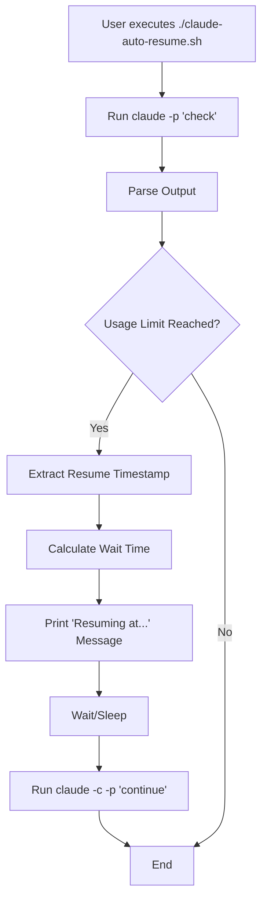

# Claude Auto-Resume Architecture Document

## Introduction

This document outlines the overall project architecture for Claude Auto-Resume. Its primary goal is to serve as the guiding architectural blueprint for development, ensuring consistency and adherence to the chosen patterns and technologies.

**Relationship to Frontend Architecture:**
This project does not include a user interface; therefore, a separate Frontend Architecture Document is not required.

### Starter Template or Existing Project

N/A. This project is a new, single-file script created from scratch.

### Change Log

| Date       | Version | Description     | Author  |
| :--------- | :------ | :-------------- | :------ |
| 2024-07-29 | 1.0     | Initial Version | Winston |

## High Level Architecture

### Technical Summary

This system's architecture is a self-contained command-line utility implemented as a single shell script. It is designed to be simple, robust, and have no external dependencies beyond standard shell commands and the `claude` CLI tool. The script automates the process of resuming a Claude task by checking the usage status, parsing the output to determine the end of a restriction period, waiting for the required time, and then executing the 'continue' command. This architecture directly supports the PRD goals of providing a seamless, automated user experience for long-running Claude tasks.

### High Level Overview

-   **Architectural Style**: Command-Line Utility. This is the simplest approach that meets all functional and non-functional requirements defined in the PRD.
-   **Repository Structure**: Polyrepo. As per the PRD, the project consists of a single script, making a dedicated repository the most straightforward approach.
-   **Service Architecture**: A single `claude-auto-resume.sh` script contains all the logic. There are no separate services.
-   **Primary User Interaction Flow**: The user executes the script from their command line. The script then interacts with the `claude` CLI on the user's behalf. It prints status messages to the console, informing the user of its state (e.g., "Usage limit reached, resuming at TIMESTAMP.").
-   **Key Architectural Decisions**:
    -   **Shell Script Implementation**: Chosen for simplicity, portability across Unix-like systems, and to meet the NFR of having no external dependencies.
    -   **Dependency on `claude` CLI**: The architecture assumes the `claude` CLI tool is installed and available in the user's PATH. This is a core assumption for the tool's operation.

### High Level Project Diagram

### Architectural and Design Patterns

Given the simplicity of the project, formal design patterns are not heavily utilized. The script follows a simple procedural and sequential logic flow.

-   **Procedural Programming**: The script executes a linear sequence of commands to achieve its goal. This is the most straightforward pattern for a simple shell script.
-   **Error Handling (Implicit)**: The script's logic implicitly handles the "no limit" case by exiting gracefully. More robust error handling could be added for cases where the `claude` command fails for other reasons.

## Tech Stack

This project leverages standard, ubiquitous technologies available in most Unix-like environments to ensure maximum portability and zero setup friction, as required by the PRD.

### Cloud Infrastructure

-   **Provider:** N/A (Local Execution)
-   **Key Services:** N/A
-   **Deployment Regions:** N/A

### Technology Stack Table

| Category       | Technology                | Version | Purpose                                              | Rationale                                           |
| :------------- | :------------------------ | :------ | :--------------------------------------------------- | :-------------------------------------------------- |
| **Language**   | Shell Script (Bash/Zsh)   | N/A     | Core logic implementation                          | Meets NFR for no external dependencies; ubiquitous. |
| **Runtime**    | User's Default Shell      | N/A     | Script execution environment                         | Provided by the OS; no installation required.       |
| **Dependencies** | `claude` CLI              | Any     | Interacting with the Claude service                | Core functional requirement of the tool.            |
| **Dependencies** | `grep`, `date`, `sleep`   | N/A     | Text parsing, time calculation, and waiting        | Standard Unix utilities; guaranteed to be present.  |
| **Testing**    | Manual                    | N/A     | As per PRD, manual testing is sufficient           | The script's behavior is simple and deterministic.  |

## Data Models

N/A. This application is stateless and does not manage any data models.

## Components

N/A. The entire logic is encapsulated within the single `claude-auto-resume.sh` script, functioning as a single component. 